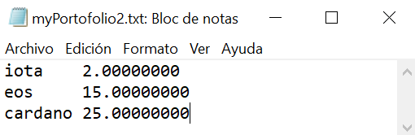
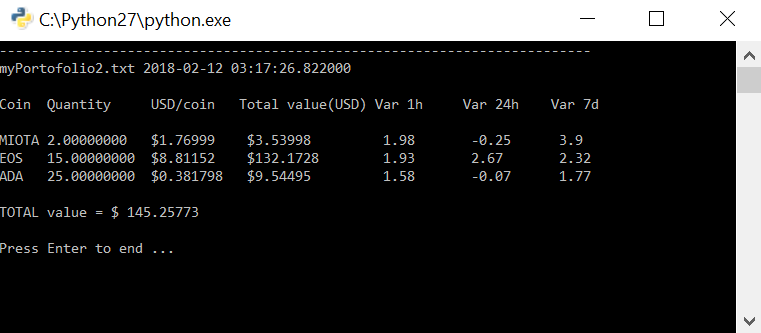

# SimpleCoinmarketcap
Simple Coinmarketcap API to your crypto portofolios

I have seen different portofolio scripts but all are complicated to understand in 5 minutes. Therefore, I propose the simplest portofolio script in python 2.7 and 3.7: read a portofolio file, connect to Coinmarketcap APIs, print the coin/token information from your portofolio(s).

## How to use it
* Place your coin names in Coinmarketcap and the quantity into a portofolio text file (TAB-separated); you can have several portofolios!
* Modify or add the portofolio file names into the main script when you call the main function (one call for each portofolio); or just add your coins and quantities in the current example files such as myPortofolio1.txt or myPortofolio2.txt.
* If you run the script, the code will connect to the Coinmarketcap APIs and it will get information about your coins.
* If you have programming skills, you can add more information to the output by using the disabled variables.
* Beccause it is the simplest script for portofolio, you have no local dataset or file writing of any value, you need to add manually your coins and to modify your quantities into the portofolio text file(s).
* The total value in USD is calculated for each portofolio but not the all the portofolios.

## Example
Let's use a portofolio as input for SimpleCoinmarketcap script:

By running SimpleCoinmarketcap.py the result will print the information for your coins/tokens:

Have fun with crypto!

muntisa
